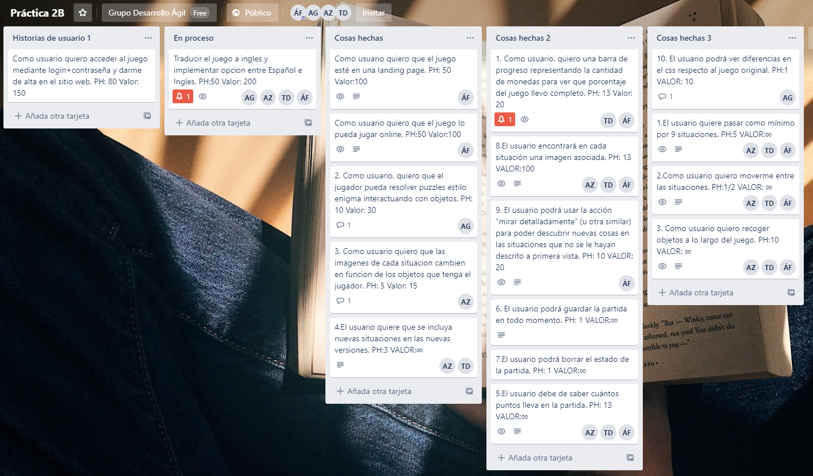

## Descripción del juego:

En este juego vas a tomar el rol de *Robertina*, una muchacha la cuál se despierta aturdida en un **laberinto**. Deberás de conseguir salir de allí, pero para ello tienes que encontrar la **llave** que abrirá la puerta final, además de resolver los distintos **enigmas** que irán apareciendo según vayas avanzando en el laberinto.

### Personaje:

Joven muchacha llamada Robertina.

## Planificación del primer sprint 

Hemos elegido estas historias de usuario estimando su realización en el primer sprint. Sus valores asignados por votación han sido:

* Historia de usuario 1: Valor de negocio ∞, Puntos de historia 5
* Historia de usuario 2: Valor de negocio ∞, Puntos de historia 1/2
* Historia de usuario 3: Valor de negocio ∞, Puntos de historia 10
* Historia de usuario 4: Valor de negocio ∞, Puntos de historia 3
* Historia de usuario 5: Valor de negocio ∞, Puntos de historia 13
* Historia de usuario 6: Valor de negocio ∞, Puntos de historia 1
* Historia de usuario 7: Valor de negocio ∞, Puntos de historia 1
* Historia de usuario 8: Valor de negocio 100, Puntos de historia 13
* Historia de usuario 9: Valor de negocio 20, Puntos de historia 10

### [URL DE TABLERO EN TRELLO](https://trello.com/b/9Db6VUtc)

## Memoria Sprint 1:

### Imagen de Product Backlog terminado el sprint:

La historia de Usuario número 4 no la hemos puesta en tareas hechas porque al ser una petición de que al añadir nuevas escenas que aporten a la historia, nos ha parecido que este requisito debe de estar en proceso hasta el fin del proyecto.

En la parte de la derecha podemos ver la actividad que ha tenido el tablero mientras se realizaban los eventos SCRUM en el sprint.

### Product Backlog Refinement:
En la reunión llegamos a la decisión de que ibamos bien de tiempo y habíamos cambiado algo del css, por lo tanto decidimos añadir solo el último requisito que se introdujo con posterioridad al guión.

### Sprint Review/Sprint Retrospective:
57.5 PH completados y sobro tiempo. Pensamos subir a 70 puntos el proximo sprint. Comunicacion por grupo whatsapp y reuniones de voz en google meetings para los daily standups. El trabajo en grupo a funcionado bien, pero vamos a cambiar el proceso de trabajo un poco. Pensamos que despues de la primera semana del sprint, analizamos cuanto trabajo nos falta y si podemos agregar mas historias al sprint, de esa manera avanzamos lo mas posible y nos podria dar la oportunidad a hacer mas con el proyecto.

### Proximo sprint:
Se ha pensado que en el proximo sprint incorporaremos enigmas para el jugador y cambiar para que cada escena se vea individualmente. Tambien cambiar imagenes dependiendo de los objetos, y barra de progreso. En el PBR añadiremos más requisitos.

## Memoria Sprint 2:

### Imagen de Product Backlog:

Hemos elegido estas tareas porque nos resultaban interesantes para la finalización del diseño del juego. No hemos descompuesto las tareas porque eran muy simples para ello. En este Sprint el Product Owner ha sido Abraham Gutiérrez.

### Product Backlog Refinement:

Nos dimos cuenta de que nos daba tiempo relaizar alguna historia más para este sprint, porque lo que añadimos una más (Como usuario quiero acceder al juego mediante login+contraseña y darme de alta en el  sitio web).

### Sprint Review:
Hemos tenido 141 PH (puntos de historia) completados. El valor completado ha sido de 265 + ∞.
Se han implementado todos los requisitos menos el último que se añadió en el Backlog Refinement.
Hemos tenido una mejor gestión a la hora de gestionarnos los puntos de historia. Nos está costando más de lo que creíamos el punto de historia del login/contraseña, y la solución que le hemos dado es hacer un estudio más profundo de su implementación en el próximo Sprint.
Los requisitos que tenemos pensado implementar en el próximo Sprint son los relacionados con el juego online.

### Sprint Retrospective:
1.Como usuario, quiero una barra de progreso representando la cantidad de monedas para ver que porcentaje del juego llevo completo: ha sido implementada por Álvaro y modificada por Teresa.

2.Como usuario, quiero que el jugador pueda resolver puzzles estilo enigma interactuando con objetos: ha sido implementada por Abraham.

3.Como usuario quiero que las imagenes de cada situacion cambien en funcion de los objetos que tenga el jugador: ha sido implementada por Ana.

4.El usuario quiere que se incluya nuevas situaciones en las nuevas versiones: ha sido realizada por Teresa y Ana.

5.Como usuario quiero que el juego esté en una landing page: ha sido realizada por Álvaro.

6.Como usario quiero que el juego pueda jugar online: ha sido realizada por Álvaro.

De aquí concluimos que con la participación de cada uno, alguno ha podido tener una participación más alta que otro.

## Memoria Sprint 3:

### Imagen de Product Backlog:

### [URL DE TABLERO EN TRELLO SUBTAREAS](https://trello.com/b/xcEfEX1f)

Hemos elegido estas tareas porque nos resultaban interesantes para que del juego lo pudiese jugar más gente. Hemos descompuesto la historia de usuario sobre la traducción pero no la del login+contraseña porque ya estimabamos desde el principio que no nos iba a dar tiempo a realizarla. En este Sprint el Product Owner ha sido Álvaro Domingo Fuentes.

### Product Backlog Refinement:

Nos dimos cuenta de que no nos daba tiempo a realizar alguna historia más para este sprint, debido a la historia login+usuario(Como usuario quiero acceder al juego mediante login+contraseña y darme de alta en el  sitio web).
Por lo tanto el Producto Backlog no recibió cambios.

### Sprint Review:

#### ¿Qué funcionalidades se han “implementado” y cuáles no?

Hemos implementado el juego en su versión en Inglés como bien nos dijo Don Victor Rivas en un correo cuando Abraham entró a formar parte del equipo de desarrollo.
No hemos implementado la historia de Login+Contraseña después de varios intentos en su realización

#### ¿Se ha revisado product backlog y estimaciones de PH y valor?

Despues de revisar el Product Backlog hemos realizado 50 PH con un valor de 200.

#### Con respecto al Equipo de programación: ¿qué ha ido bien, qué problemas surgieron y qué soluciones dimos?

La implementación del juego en inglés no ha habido ningún problema pero, surgieron diversos problemas con la implementación de la historia de Login+Contraseña debido a que, nos encontrabamos con que nadie del equipo tenía conocimientos previos para la realización de esta misma, la búsqueda de información fue lenta y costosa y dado que no hemos podido dedicar todo el tiempo que nos hubiese gustado en el desarrollo de la misma, no logramos darle solución.

#### ¿Por dónde seguir? ¿Qué es lo siguiente que aporta más valor al producto?

En este caso damos por concluidas estas preguntas porque este sprint es el último. 

### Sprint Retrospective:

1.Como usuario, quiero poder jugar el juego completamente en inglés o en español: ha sido implementada por Álvaro, Teresa, y Ana, Traducida en su totalidad por Abraham.

Todo esto se ha ido realizando equitatevamente entre todo el grupo a diferencía de las líneas que haya añadido cada componentes ya que:

- Álvaro ha implementado el botón en la landing page para ofrecer la opción en inglés, ha implementado escenas en inglés y ha redactado la memoria.
- Teresa ha implementado escenas en inglés
- Ana ha implementado escenas en inglés
- Abraham ha traducido todas las escenas a inglés

Toda nuestra comunicación se ha realizado mediante la plataforma Whatsapp y tablones en Trello. Para edición de texto se ha usado la aplicación Atom. También se ha utilizado Googe Meet para las conclusiones de la memoria y la daily scrum.
